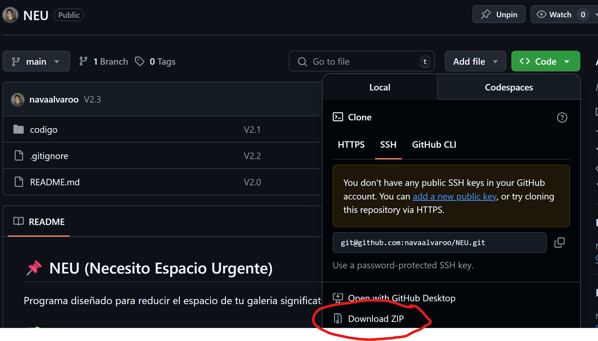
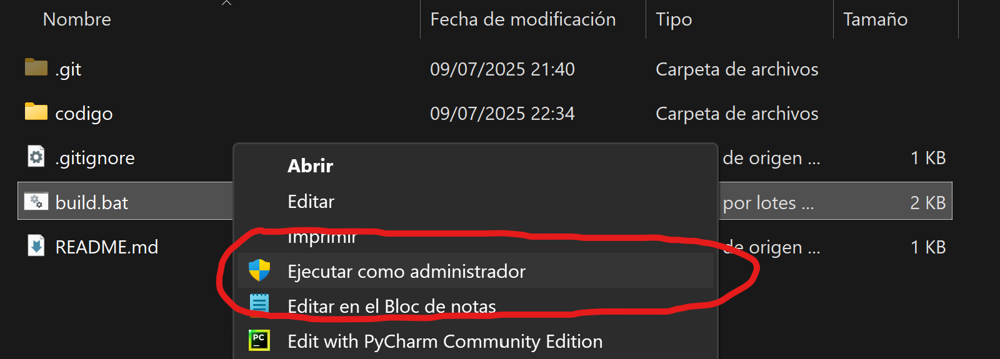
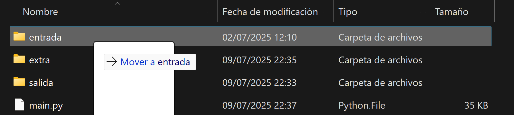

## 📌 NEU (Necesito Espacio Urgente)
Programa diseñado para reducir el espacio de tu galería significativamente, si necesitas espacio extra.

## 🗂️ Guía de Uso
**Descarga los archivos necesarios**

**Ejecuta** el archivo "**build.bat**" con permisos de administrador.

**Copia** las **fotos** y **videos**, en la **carpeta entrada**.

